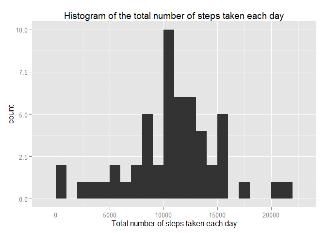
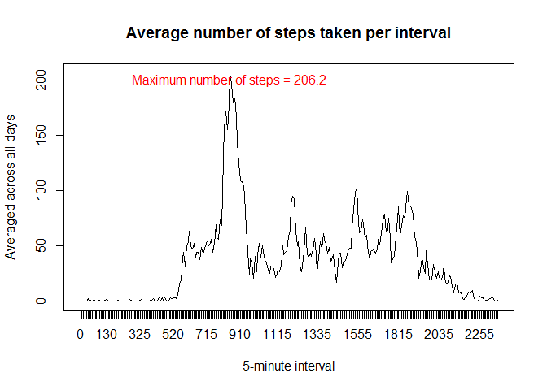
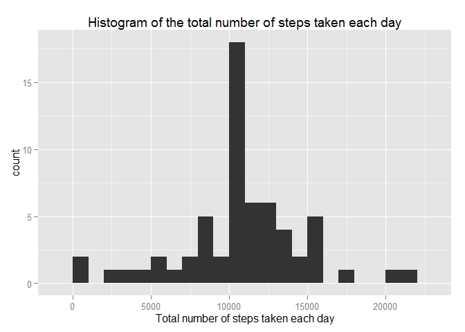
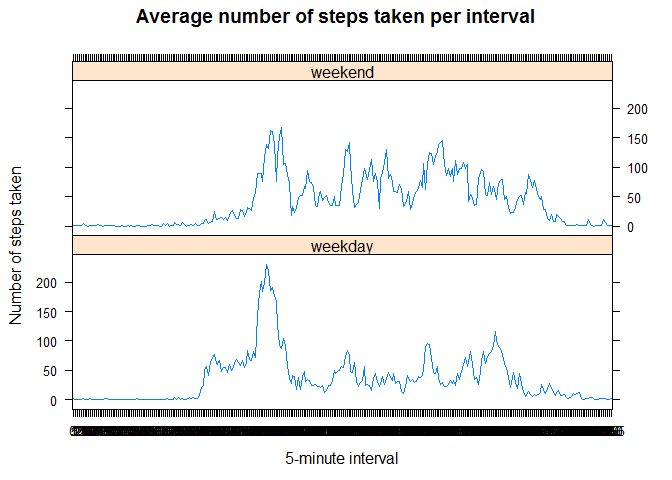

# Reproducible Research: Peer Assessment 1
Ron Ferens  
Saturday, July 18, 2015  

##Data  
The variables included in this dataset are:

- **steps:** Number of steps taking in a 5-minute interval (missing values are coded as NA)

- **date:** The date on which the measurement was taken in YYYY-MM-DD format

- **interval:** Identifier for the 5-minute interval in which measurement was taken

##Loading and preprocessing the data

Loading the measured (raw) data. In order to make analysis easier, we'll first convert the *interval* variable to factor:


```r
rawData <- read.csv("C:/Users/rferens/Git/datasciencecoursera/Reproducible.Research/Project.01/Data/activity.csv")
rawData$interval<-factor(rawData$interval)
summary(rawData)
```

```
##      steps                date          interval    
##  Min.   :  0.00   2012-10-01:  288   0      :   61  
##  1st Qu.:  0.00   2012-10-02:  288   5      :   61  
##  Median :  0.00   2012-10-03:  288   10     :   61  
##  Mean   : 37.38   2012-10-04:  288   15     :   61  
##  3rd Qu.: 12.00   2012-10-05:  288   20     :   61  
##  Max.   :806.00   2012-10-06:  288   25     :   61  
##  NA's   :2304     (Other)   :15840   (Other):17202
```

##What is mean total number of steps taken per day?

In order to make sure our initial processing is not affected by NA values, we will remove the incomplete entires and generate a sub-set with complete entires: (Notice there are no NA entires)


```r
data <- rawData[complete.cases(rawData),]
summary(data)
```

```
##      steps                date          interval    
##  Min.   :  0.00   2012-10-02:  288   0      :   53  
##  1st Qu.:  0.00   2012-10-03:  288   5      :   53  
##  Median :  0.00   2012-10-04:  288   10     :   53  
##  Mean   : 37.38   2012-10-05:  288   15     :   53  
##  3rd Qu.: 12.00   2012-10-06:  288   20     :   53  
##  Max.   :806.00   2012-10-07:  288   25     :   53  
##                   (Other)   :13536   (Other):14946
```

**1. Calculate the total number of steps taken per day**


```r
totalNumberOfStepsPerDay <- tapply(data$steps, data$date, sum)
```

**2. Make a histogram of the total number of steps taken each day**


```r
library(ggplot2)

qplot(totalNumberOfStepsPerDay,
     binwidth = 1000,
     xlab="Total number of steps taken each day",
     main="Histogram of the total number of steps taken each day")
```

 

**3. Calculate and report the mean and median of the total number of steps taken per day**


```r
mean(totalNumberOfStepsPerDay, na.rm=TRUE)
```

[1] 10766.19

```r
median(totalNumberOfStepsPerDay, na.rm=TRUE)
```

[1] 10765

##What is the average daily activity pattern?

**1. Make a time series plot (i.e. type = "l") of the 5-minute interval (x-axis) and the average number of steps taken, averaged across all days (y-axis)**


```r
averageNumberOfStepsTakenPerInterval <- tapply(data$steps, data$interval, mean)
maxInterval<-which.max(averageNumberOfStepsTakenPerInterval)
plot(averageNumberOfStepsTakenPerInterval, type="l",
     main="Average number of steps taken per interval",
     ylab="Averaged across all days",
     xlab="5-minute interval",
     xaxt="n")
axis(1, at=1:length(averageNumberOfStepsTakenPerInterval), labels=levels(data$interval), srt=45)
abline(v=maxInterval, col = "red")
text(x=maxInterval, y=200, sprintf("Maximum number of steps = %3.1f", max(averageNumberOfStepsTakenPerInterval)), col = "red")
```

 

**2. Which 5-minute interval, on average across all the days in the dataset, contains the maximum number of steps?**

As seen in the plot above, here is the 5-minute interval that contains the maximum number of steps:


```r
data$interval[which.max(averageNumberOfStepsTakenPerInterval)]
```

```
## [1] 835
## 288 Levels: 0 5 10 15 20 25 30 35 40 45 50 55 100 105 110 115 120 ... 2355
```

##Imputing missing values

**1. Calculate and report the total number of missing values in the dataset**

The number of days/intervals where there are missing values is:

```r
sum(!complete.cases(rawData))
```

```
## [1] 2304
```

**2. Devise a strategy for filling in all of the missing values in the dataset**

In order to fill the missing values in the dataset, we will use the results of the analysis done in the previous section. For each missing entry for stpes, we will enter the average steps take, averaged across all the days in the dataset, according to the corresponding 5-minutes interval.

**3. Create a new dataset that is equal to the original dataset but with the missing data filled in**


```r
# Replace each missing value with the mean value of its 5-minute interval
avrgValue <- function(steps, interval) {
  stepsValue<-steps
  if (is.na(steps)) 
    stepsValue <- averageNumberOfStepsTakenPerInterval[interval]
  return(stepsValue)
}

completedData <- rawData
completedData$steps <- mapply(avrgValue, completedData$steps, completedData$interval)
```

Notice that the new dataset is equal to the original dataset (by size), but with no **"NA"** values

**4. Make a histogram of the total number of steps taken each day and Calculate and report the mean and median total number of steps taken per day**


```r
totalNumberOfStepsPerDay <- tapply(completedData$steps, completedData$date, sum)

qplot(totalNumberOfStepsPerDay,
     binwidth = 1000,
     xlab="Total number of steps taken each day",
     main="Histogram of the total number of steps taken each day")
```

 

```r
mean(totalNumberOfStepsPerDay, na.rm=TRUE)
```

```
## [1] 10766.19
```

```r
median(totalNumberOfStepsPerDay, na.rm=TRUE)
```

```
## [1] 10766.19
```

As showm above, after replacing the missing values (coded as **NA**), these values differ from the estimates from the first part of the assignment and now they have higher values than before. The original dataset had entires which lack the input of number of steps. Hence those entries were neglected resulting in sum of *0 stpes* taken. Once replaced ,with the average values corresponding to their 5-minutes interval, those entires impact the total sum by adding the mean value instead of 0.

##Are there differences in activity patterns between weekdays and weekends?

**1. Create a new factor variable in the dataset with two levels - "weekday" and "weekend" indicating whether a given date is a weekday or weekend day**


```r
setDayType <- function(day) {
  setDayType <- "weekday"
  
  type <- weekdays(as.Date(day))
  if((type == "Saturday") || (type == "Sunday"))
    setDayType <- "weekend"

  return(factor(setDayType))
}

completedData$dayType <- mapply(setDayType, completedData$date)
summary(completedData$dayType)
```

```
## weekday weekend 
##   12960    4608
```

**2.Make a panel plot containing a time series plot (i.e. type = "l") of the 5-minute interval (x-axis) and the average number of steps taken, averaged across all weekday days or weekend days (y-axis)**


```r
averageData <- aggregate(steps ~ interval + dayType, data = completedData, mean)

library(lattice)
xyplot(data = averageData,
       steps ~ interval|dayType,
       main="Average number of steps taken per interval",
       xlab="5-minute interval",
       ylab="Number of steps taken",
       layout=c(1,2),
       type="l")
```

 
